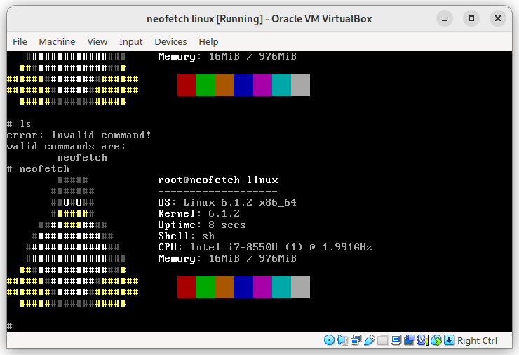

# neofetch-linux

a linux distribution that boots, immediately runs neofetch, and then drops you to a prompt that can do nothing but run neofetch again.



## build

```
$ ./build.sh fetch                  # fetch required source code (linux kernel, musl cross-compiler, busybox, bash, neofetch)
$ NL_ARCH=x86_64 ./build.sh build   # build neofetch-linux-x86_64.iso
```

supported architectures (values for `NL_ARCH`) are `x86_64` and `i686`. it is highly likely that other architectures will build with minimal (but nonzero) effort; you are welcome to try.

when changing which architecture you're building for (eg. switching to `i686` after having built `x86_64`), it is necessary to call `./build.sh clean_buildroot`, since buildroot configs change between architectures and buildroot's build system does not notice that they do.

for a complete list of commands that `build.sh` supports, run it without any parameters.

## license

the code provided in this repository (build.sh, grub.cfg, sethostname.c, and init script) are under the MIT license; see LICENSE.md. the components fetched and built by the build script are provided by their respective authors under their respective terms.
